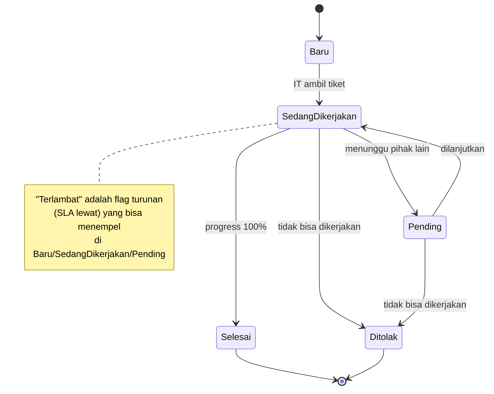

# Fase 1.2 — Software Requirement Specification (SRS)

> **Tujuan tahap ini:** Memformalkan kebutuhan menjadi *use case*, aturan bisnis, dan
> *state machine* status tiket, sehingga developer & tester punya acuan tunggal yang tegas.
> Mengacu pada gaya IEEE 830 (diringkas agar praktis).

## 1. Ruang Lingkup

Sistem web *Task Management + Ticketing* internal perusahaan untuk mengelola permintaan IT
dari pengajuan hingga evaluasi. Terdiri dari **REST API backend** dan **SPA frontend**.
Di luar lingkup: sistem HR, inventory aset (mungkin fase depan), integrasi WhatsApp.

## 2. Use Case Utama

```mermaid
graph TD
    Client([Client])
    IT([IT Support])
    Admin([Administrator])

    Client --> UC1[Buat Tiket]
    Client --> UC2[Lihat Progres Tiketku]
    Client --> UC3[Chat pada Tiket]
    Client --> UC4[Beri Rating Penyelesaian]

    IT --> UC5[Lihat Dashboard & Antrian]
    IT --> UC6[Ambil Tiket]
    IT --> UC7[Ubah Status / Progress]
    IT --> UC8[Tutup / Tolak Tiket]
    IT --> UC3

    Admin --> UC9[Kelola User & Role]
    Admin --> UC10[Konfigurasi SLA & Kategori]
    Admin --> UC11[Lihat Laporan & Analitik]
    Admin --> UC12[Lihat Audit Log]
    Admin --> UC5
```

## 3. Rincian Use Case Kunci

### UC1 — Buat Tiket (Client)
- **Prakondisi:** user login sebagai Client.
- **Alur normal:**
  1. Client mengisi form (judul, deskripsi, divisi, kategori, prioritas, deadline, lampiran).
  2. Sistem generate nomor tiket unik & set status `Baru`.
  3. Sistem hitung target SLA dari prioritas.
  4. Sistem catat activity log & kirim notifikasi ke IT.
- **Alur alternatif:** validasi gagal → tampilkan pesan error per-field, data tidak tersimpan.
- **Pascakondisi:** tiket tersimpan, tampil di antrian IT.

### UC6 — Ambil Tiket (IT)
- **Prakondisi:** tiket berstatus `Baru` (belum diambil siapa pun).
- **Alur:** IT klik "Ambil" → sistem kunci tiket ke teknisi tsb, set status `Sedang Dikerjakan`,
  simpan `assigned_to` & `started_at`, catat log, notifikasi ke Client.
- **Aturan konkurensi:** jika dua IT menekan "Ambil" bersamaan, hanya yang pertama berhasil
  (dijamin lewat *atomic update* `WHERE status='Baru' AND assigned_to IS NULL`).

### UC8 — Tutup / Tolak Tiket (IT)
- **Selesai:** set status `Selesai`, `completed_at`, progress 100%. Notifikasi Client → Client
  boleh beri rating.
- **Tolak (Tidak Bisa Dikerjakan):** wajib isi Alasan, Berita Acara, Rekomendasi, Catatan.
  Set status `Ditolak`. Data ini masuk *berita acara* untuk pelaporan.

## 4. Aturan Bisnis (Business Rules)

- **BR-1 (Penomoran):** `TKT-YYYYMM-NNNNNN`, urut per bulan, tidak boleh bolong/duplikat.
- **BR-2 (Sorting antrian):** urut `priority_weight DESC, created_at ASC` (Urgent=4..Low=1).
- **BR-3 (SLA):** `sla_due_at = created_at + durasi(prioritas)`. Indikator:
  🟢 jika sisa > 50% durasi, 🟡 jika sisa 0–50%, 🔴 jika `now > sla_due_at`.
- **BR-4 (Terlambat):** status `Terlambat` bersifat *derived* — dihitung dari `sla_due_at`
  vs waktu, bukan status manual (job terjadwal menandai tiket yang lewat SLA & belum selesai).
- **BR-5 (Kunci tiket):** hanya `assigned_to` atau Admin yang boleh ubah progress/status.
- **BR-6 (Immutability chat & log):** pesan & activity log tidak bisa diedit/dihapus user biasa.
- **BR-7 (Progress monoton opsional):** progress umumnya naik; penurunan dicatat di log.

## 5. State Machine Status Tiket

## 6. Antarmuka Eksternal
- **API:** REST/JSON, terdokumentasi via OpenAPI (Swagger UI).
- **Auth:** token-based (SPA + API terpisah). Detail di dokumen arsitektur.
- **Storage file:** abstraksi filesystem (lokal saat dev, cloud saat produksi) tanpa ubah kode.

## 7. Kriteria Penerimaan MVP (Definition of Done)
1. 3 role bisa login & akses sesuai RBAC.
2. Client buat tiket → muncul terurut prioritas di dashboard IT.
3. IT ambil → kerjakan → progress → selesai/tolak, Client lihat perubahan realtime.
4. Chat + timeline berfungsi & tersimpan.
5. Setiap aksi tercatat di activity log lengkap dengan IP & browser.
6. Indikator SLA (🟢🟡🔴) tampil benar.

---
**Next:** `04-teknologi-stack.md` — keputusan teknologi beserta perbandingan yang Anda minta.
