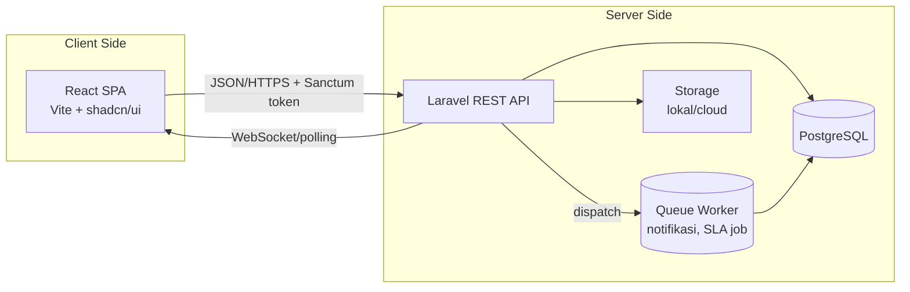

# Fase 1.4 — Arsitektur Aplikasi

> **Tujuan tahap ini:** Menetapkan *bagaimana* kode ditata agar bersih, teruji, dan mudah
> dirawat — menerapkan Clean Architecture, SOLID, Repository + Service Layer, DTO, Policy,
> Queue, dan Caching seperti yang Anda minta.

## 1. Gambaran Besar (High-Level)



Frontend dan backend **terpisah (decoupled)**. Keuntungan: bisa di-*deploy* & di-*scale*
sendiri-sendiri, dan suatu saat bisa dipakai ulang untuk aplikasi mobile.

## 2. Arsitektur Berlapis di Backend (Clean Architecture)

Alur request mengalir masuk ke lapisan luar lalu ke dalam; ketergantungan selalu menunjuk
"ke dalam" (SOLID — Dependency Inversion).

```
HTTP Request
   │
   ▼
[Route] → [Middleware]  (auth, RBAC, rate limit, activity-log)
   │
   ▼
[Controller]            tipis: hanya orkestrasi
   │  ── validasi ──►   [Form Request]  (validasi input)
   │  ── bungkus ──►    [DTO]           (objek data antar-lapisan)
   ▼
[Service Layer]         LOGIKA BISNIS (SLA, sorting, state machine, penomoran)
   │
   ▼
[Repository]            abstraksi akses data (interface)
   │
   ▼
[Eloquent Model] → [PostgreSQL]
   │
   ▼
[API Resource]          bentuk output JSON yang konsisten
```

**Kenapa berlapis?**
- **Controller tipis** → mudah dibaca, tidak ada logika bisnis nyasar.
- **Service Layer** → satu tempat untuk aturan bisnis (mis. `TicketService::assign()`),
  bisa diuji tanpa HTTP.
- **Repository Pattern** → mengunci akses DB di belakang *interface*; memudahkan testing
  (mock) dan potensi ganti sumber data. *(Catatan jujur: di Laravel repository kadang dianggap
  berlebihan. Kita pakai selektif untuk query kompleks — laporan/analitik — bukan CRUD sepele,
  agar tidak menambah boilerplate tanpa manfaat.)*
- **DTO** → data pindah antar-lapisan dalam bentuk eksplisit & bertipe, bukan array liar.

## 3. Penerapan SOLID (contoh nyata)
- **S**ingle Responsibility: `SlaCalculator`, `TicketNumberGenerator`, `TicketAssigner` terpisah.
- **O**pen/Closed: kanal notifikasi (in-app, email, push) lewat *interface* `NotificationChannel`
  — tambah kanal tanpa mengubah kode lama.
- **L**iskov: semua channel bisa saling gantikan.
- **I**nterface Segregation: interface kecil & fokus.
- **D**ependency Inversion: Service bergantung pada *interface* Repository, bukan Eloquent langsung.

## 4. Struktur Folder (Backend Laravel)

```
app/
├─ Http/
│  ├─ Controllers/Api/        # controller tipis per resource
│  ├─ Requests/               # Form Request = validasi
│  ├─ Resources/              # API Resource = format JSON
│  └─ Middleware/             # RBAC, ActivityLogger, dsb
├─ Services/                  # logika bisnis (Ticket, Sla, Notification, Report)
├─ Repositories/
│  ├─ Contracts/              # interface
│  └─ Eloquent/               # implementasi
├─ DTOs/                      # objek transfer data
├─ Models/                    # Eloquent
├─ Policies/                  # otorisasi per-aksi (RBAC halus)
├─ Jobs/                      # queue: kirim notifikasi, tandai SLA lewat
├─ Events/ & Listeners/       # mis. TicketCreated → notify
└─ Enums/                     # Priority, Status, Category, Role
database/
├─ migrations/  seeders/  factories/
routes/api.php
tests/  (Feature + Unit)
```

## 5. Struktur Folder (Frontend React)

```
src/
├─ app/                 # setup router, providers (React Query, theme)
├─ features/            # per-domain: tickets, dashboard, chat, reports, auth
│  └─ tickets/          # components, hooks, api, types khusus fitur
├─ components/ui/       # shadcn/ui (Button, Dialog, ...)
├─ components/          # komponen bersama (AppShell, Sidebar, DataTable)
├─ lib/                 # api client (axios), utils, auth
├─ hooks/               # hooks lintas fitur
└─ types/               # tipe TypeScript global
```

Pola **feature-based** (bukan type-based) agar setiap modul (tiket, chat, laporan) mandiri
dan mudah ditemukan — cocok untuk aplikasi yang tumbuh.

## 6. Keputusan Lintas-Cutting

| Aspek | Keputusan |
|-------|-----------|
| **Auth** | Laravel Sanctum (token untuk SPA); token disimpan aman, dikirim via header |
| **Otorisasi** | Middleware role + **Policy** per-aksi (mis. hanya assignee boleh ubah progress) |
| **Validasi** | Form Request di server (sumber kebenaran) + validasi ringan di klien (UX) |
| **State server (FE)** | React Query — caching, refetch, optimistic update, polling realtime |
| **Realtime** | MVP: polling React Query tiap N detik; upgrade: Laravel Reverb (WebSocket) |
| **Queue** | Job async untuk notifikasi & scheduler cek SLA (`sla_due_at` lewat) |
| **Caching** | Cache data referensi (kategori, konfigurasi SLA) & agregasi laporan |
| **Config** | `.env` per environment; tidak ada secret di repo |
| **API Docs** | OpenAPI/Swagger UI dari anotasi controller |
| **Error format** | Envelope JSON konsisten `{data, message, errors}` |

## 7. Keamanan (dipetakan ke kebutuhan)

| Ancaman | Mitigasi |
|---------|----------|
| SQL Injection | Eloquent/query builder (parameter binding), tanpa string concat |
| XSS | Escape default; sanitasi input HTML chat; React auto-escape |
| CSRF | Sanctum + SameSite cookie / token header untuk SPA |
| Brute force | Rate limit login & endpoint sensitif |
| Password bocor | Hash bcrypt/argon2, tak pernah disimpan plain |
| Akses tak sah | RBAC + Policy, cek kepemilikan tiket |
| Manipulasi diam-diam | Activity Log + Audit Log (before/after) |
| Transport | HTTPS-ready (dipaksa di produksi) |

---
**Next:** `06-database-erd.md` — model data, ERD, normalisasi, index, foreign key.
