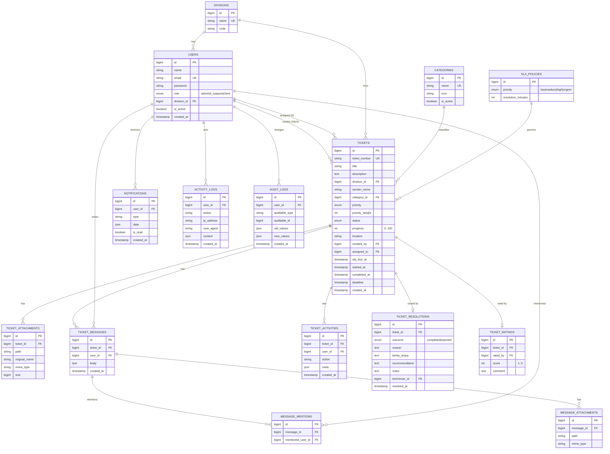

# Fase 1.5 — Desain Database & ERD

> **Tujuan tahap ini:** Merancang model data yang ternormalisasi, dengan relasi, index,
> foreign key, dan aturan cascade yang jelas — fondasi untuk migration & seeder di fase koding.

## 1. Entity Relationship Diagram (ERD)

## 2. Normalisasi (mengapa tabel dipecah begini)

- **3NF** sebagai basis: setiap atribut bergantung penuh pada *primary key*, tidak ada
  ketergantungan transitif.
- **Divisi & Kategori** dipisah jadi tabel referensi (bukan kolom string di `tickets`) →
  menghindari duplikasi & salah ketik, dan memenuhi FR-6 (kategori bisa ditambah tanpa deploy).
- **`sender_name` sengaja denormalisasi** di `tickets`: menyimpan nama pengirim apa adanya saat
  tiket dibuat (bisa berbeda dari nama akun, mis. mengajukan atas nama rekan). Ini keputusan sadar.
- **Resolusi, rating, lampiran, pesan, aktivitas** dipisah ke tabel anak → satu tiket punya
  banyak, dan tabel `tickets` tetap ramping (baik untuk performa daftar/antrian).
- **`priority_weight`** disimpan (turunan dari `priority`) khusus untuk *sorting* cepat & ter-index
  (Urgent=4, High=3, Medium=2, Low=1) — trade-off kecil demi query antrian yang efisien (BR-2).

## 3. Index & Kunci

| Tabel | Index | Alasan |
|-------|-------|--------|
| tickets | `(status)`, `(priority_weight, created_at)` | filter dashboard & sorting antrian (BR-2) |
| tickets | `(assigned_to)`, `(created_by)` | "Task Saya" / tiket milik client |
| tickets | `(sla_due_at)` | job penanda keterlambatan & indikator SLA |
| tickets | `ticket_number` UNIQUE | penomoran unik (BR-1) |
| ticket_messages | `(ticket_id, created_at)` | ambil timeline chat berurutan |
| activity_logs | `(user_id, created_at)` | audit per user |
| audit_logs | `(auditable_type, auditable_id)` | jejak perubahan per entitas |
| notifications | `(user_id, is_read)` | badge "belum dibaca" |

## 4. Foreign Key & Aturan Cascade

- `ticket_attachments`, `ticket_messages`, `ticket_activities`, `ticket_resolutions`,
  `ticket_ratings`, `message_*` → **ON DELETE CASCADE** dari `tickets`/`ticket_messages`
  (anak ikut terhapus jika induk dihapus — namun penghapusan tiket dibatasi Admin & tercatat audit).
- `tickets.assigned_to`, `tickets.created_by` → **ON DELETE RESTRICT/SET NULL**: user yang punya
  histori tiket **tidak boleh** dihapus keras; pakai `is_active=false` (soft deactivate) agar
  histori & laporan tetap utuh.
- `tickets.category_id`, `division_id` → **ON DELETE RESTRICT**: referensi yang dipakai tak boleh
  dihapus; nonaktifkan lewat `is_active` saja.

## 5. Data Referensi Awal (untuk Seeder)
- **Roles:** admin, it_support, client.
- **Kategori:** Hardware, Software, Printer, Internet, Network, Email, Website, Server, CCTV,
  Aplikasi, Lainnya.
- **SLA default:** Low=4320 mnt (3 hari), Medium=2880 (2 hari), High=1440 (1 hari), Urgent=240 (4 jam).
- **Prioritas → weight:** low=1, medium=2, high=3, urgent=4.

## 6. Catatan Integritas
- Penomoran tiket dijamin unik via constraint UNIQUE + generator transaksional (hindari *race*).
- Progress dibatasi 0–100 (CHECK constraint) & kelipatan 25 divalidasi di service.
- Rating 1–5 (CHECK constraint).

---
Ini menutup **Fase 1 (Analisis & Desain Fondasi)**. Langkah berikut butuh persetujuan Anda —
lihat `docs/00-roadmap.md`.
